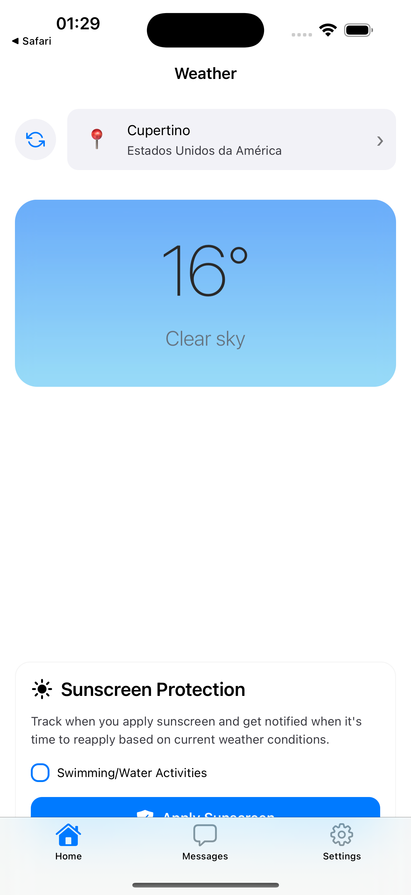
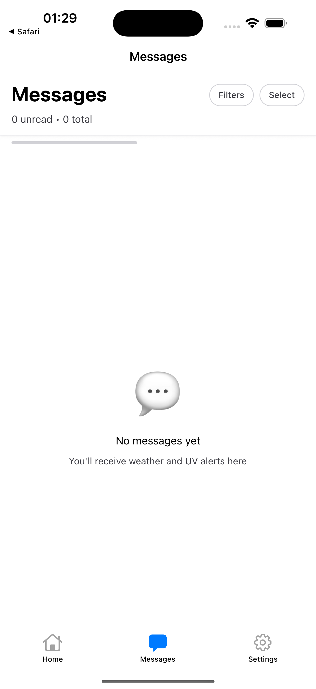
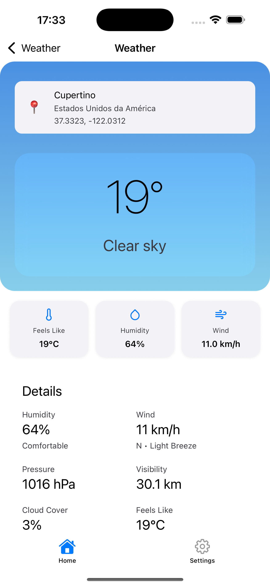
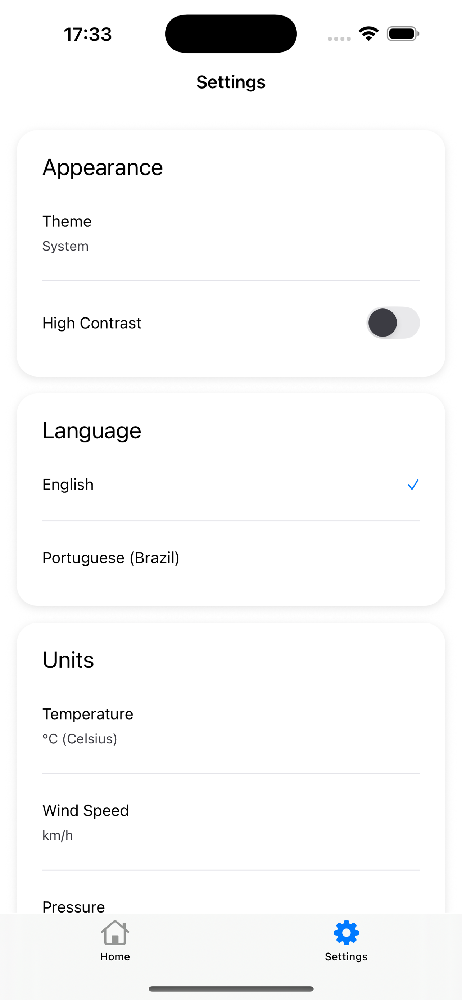

# ☀️ Weather Sunscreen App

<div align="center">


**Smart UV Protection & Personalized Sunscreen Recommendations**

[](https://expo.dev)
[](https://reactnative.dev)
[](https://www.typescriptlang.org)
[](LICENSE)
[](CHANGELOG.md)

[Features](#-features) • [Screenshots](#-screenshots) • [Installation](#-installation) • [Documentation](#-documentation) • [Contributing](#-contributing)

</div>

---

## 📱 Overview

Weather Sunscreen is a React Native mobile application that provides **real-time UV index monitoring** and **AI-powered sunscreen recommendations**. Built with Expo SDK 54, it features iOS 26 Liquid Glass UI and Material Design 3, delivering premium aesthetics with professional functionality.

### 🎯 Core Value Proposition

Stop guessing your UV exposure. Get personalized sun safety guidance based on your location, weather conditions, and skin type—preventing burns, premature aging, and long-term skin damage.

### 🌟 Key Highlights

- ⚡ **Real-Time UV Monitoring** - Location-specific UV index tracking
- 🤖 **AI-Powered Recommendations** - Personalized SPF suggestions via Vercel AI SDK
- 🔔 **Smart Alerts** - Reapplication reminders based on activity and sun exposure
- 📍 **Location-Based** - Automatic weather updates as you move
- 📅 **7-Day Forecasts** - Plan outdoor activities with confidence
- 🎨 **Premium UI** - iOS 26 Liquid Glass + Material Design 3
- 🌐 **Multi-Platform** - iOS 16+, Android API 29+, Web

---

## ✨ Features

### 🛡️ Sun Protection

- **Personalized SPF Recommendations** - Customized by Fitzpatrick skin type (I-VI)
- **UV Index Monitoring** - Real-time data with color-coded risk levels
- **Reapplication Tracking** - Smart timers with haptic feedback
- **Water Resistance Tracking** - Specific alerts for swimmers
- **Activity-Based Alerts** - Adjust protection based on outdoor duration

### ☁️ Weather Intelligence

- **Comprehensive Data** - Temperature, humidity, wind speed, "feels like"
- **7-Day Forecasts** - Hourly and daily predictions
- **Location Services** - Auto-detect position or manual entry
- **Weather Conditions** - Sunny, rainy, cloudy, snowy with animated gradients
- **Historical Tracking** - Weather pattern analysis

### 🎨 Premium User Experience

- **iOS 26 Liquid Glass UI** - Native glass effects with graceful fallbacks
- **Material Design 3** - Tonal elevation and emphasized easing
- **Parallax Scrolling** - Dynamic header animations
- **Haptic Feedback** - 15+ tactile interaction points
- **Staggered Animations** - Sequential card entrance (50ms delays)
- **Dark Mode** - System-aware theming with high contrast support
- **Accessibility** - WCAG 2.2 AAA compliance, VoiceOver/TalkBack support

### 🌍 Internationalization

- **Multi-Language** - English, Portuguese (i18next)
- **Localized Units** - Metric/Imperial temperature, wind, pressure
- **12/24 Hour Format** - User preference respected
- **Regional Weather** - Data from OpenMeteo API

---

## 📸 Screenshots

<div align="center">

| Home Screen | UV Index | Weather Detail | Settings |
|-------------|----------|----------------|----------|
|  |  |  |  |

*iOS 26 Liquid Glass UI with dramatic hero components and smooth animations*

**App Store Ready:** 8 screenshots generated (4 iPhone + 4 iPad) at exact dimensions required by App Store Connect
📱 iPhone: 1284×2778 (6.7" display) | 📱 iPad: 2064×2752 (13" display)

See [docs/APP_STORE_SCREENSHOTS.md](docs/APP_STORE_SCREENSHOTS.md) for screenshot generation guide.

</div>

---

## 🏗️ Architecture

### Technology Stack

```
┌─────────────────────────────────────────────────────────┐
│                    Presentation Layer                    │
│  React 19.1 + React Native 0.81.4 (New Architecture)   │
│  Expo Router v6 (File-based Navigation)                 │
│  iOS 26 Liquid Glass + Material Design 3                │
└─────────────────────────────────────────────────────────┘
                            ↓
┌─────────────────────────────────────────────────────────┐
│                    Business Logic Layer                  │
│  Context API (Weather, Messages, Settings, Theme)       │
│  Custom Hooks (useWeather, useHaptics, useDynamicFont) │
│  Service Layer (WeatherService, AIService, Logger)      │
└─────────────────────────────────────────────────────────┘
                            ↓
┌─────────────────────────────────────────────────────────┐
│                      Data Layer                          │
│  AsyncStorage (Preferences, Cache)                       │
│  SecureStore (API Keys)                                  │
│  SQLite (Messages, Alerts)                               │
└─────────────────────────────────────────────────────────┘
                            ↓
┌─────────────────────────────────────────────────────────┐
│                    External Services                     │
│  OpenMeteo API (Weather Data)                            │
│  Anthropic Claude (AI Recommendations via Vercel SDK)   │
│  Expo Location (GPS)                                     │
└─────────────────────────────────────────────────────────┘
```

### Key Design Patterns

- **Service Layer Pattern** - Singleton services via ES modules
- **Context + Hooks** - Centralized state management
- **Component Composition** - Reusable UI primitives
- **Token-Based Design System** - `src/theme/tokens.ts`
- **Immutable Cache** - Prevents data corruption in WeatherService

### Project Structure

```
weather-suncreen-app/
├── app/                          # Expo Router v6 routes
│   ├── _layout.tsx               # Root layout (fonts, splash, theme)
│   ├── (tabs)/                   # Tabbed navigation
│   │   ├── (home)/               # Home, UV, Weather Detail
│   │   ├── (messages)/           # Messages & Alerts
│   │   └── (styles)/             # Settings & Personalization
│   └── (dev)/                    # Dev tools (Icon/Glass galleries)
├── src/
│   ├── components/               # Reusable UI components
│   │   ├── glass/                # Liquid Glass components
│   │   ├── ui/                   # Material Design 3 components
│   │   └── weather/              # Weather-specific components
│   ├── context/                  # React Context providers
│   ├── services/                 # Business logic & API services
│   ├── theme/                    # Design tokens & theming
│   ├── types/                    # TypeScript definitions
│   ├── utils/                    # Utility functions
│   └── i18n/                     # Internationalization (i18next)
├── assets/                       # Images, fonts, icons
├── docs/                         # Technical documentation
│   ├── REF_DOC/                  # Reference docs (1096+ files)
│   │   ├── docs_apple/           # iOS 26, Swift, SwiftUI
│   │   ├── docs_ai-sdk_dev/      # Vercel AI SDK, GPT-5
│   │   └── docs_expo_dev/        # Expo SDK 54 guides
│   └── *.md                      # Project documentation
├── website-weather/              # Landing page (HTML/CSS/JS)
├── ios/                          # Native iOS project
├── android/                      # Native Android project
├── app.json                      # Expo configuration
├── package.json                  # Dependencies & scripts
├── tsconfig.json                 # TypeScript config (strict mode)
└── CHANGELOG.md                  # Version history
```

---

## 🚀 Installation

### Prerequisites

- **Node.js** 20.19.4+
- **Bun** 1.0+ (or npm/yarn)
- **Xcode** 16+ (iOS development)
- **Android Studio** (Android development)
- **Java 17** (Android builds)
- **CocoaPods** (iOS dependencies)

### Quick Start

```bash
# Clone repository
git clone https://github.com/yourusername/weather-suncreen-app.git
cd weather-suncreen-app

# Install dependencies
bun install

# iOS setup
cd ios && pod install && cd ..

# Start development server
bun start

# Run on platforms
bun run ios          # iOS (auto-selects simulator)
bun run android      # Android (requires Java 17)
bun run web          # Web development server
```

### Development Builds

Expo Go does **not** support custom native modules (WeatherKit, Liquid Glass). Use Development Builds:

```bash
# iOS Development Build
bun run ios

# Android Development Build
bun run android

# Release builds
bun run ios:release      # iOS release
bun run android:release  # Android APK
bun run android:aab      # Android App Bundle
```

### Environment Variables

Create `.env` file (optional for AI features):

```bash
# Vercel AI SDK (Optional - for AI recommendations)
EXPO_PUBLIC_ANTHROPIC_API_KEY=your_key_here
```

---

## 🧪 Testing

### Unit Tests (Jest + React Native Testing Library)

```bash
# Run all tests
npm test

# Watch mode
npm test -- --watch

# Coverage report
npm test -- --coverage

# Specific suite
npm test -- WeatherService
```

### E2E Tests (Maestro)

```bash
# Install Maestro
curl -Ls "https://get.maestro.mobile.dev" | bash

# Run iOS flow
npx maestro test maestro/flows/ios-launch.yaml

# Run Liquid Glass test
npx maestro test maestro/flows/liquid-glass-and-theme.yaml
```

### Current Test Coverage

- ✅ **WeatherService** - 12 tests (cache immutability, API fallbacks, error handling)
- ✅ **All tests passing** - 100% success rate
- 🎯 **Target** - 80%+ coverage (see `docs/MODERNIZATION_PLAN.md`)

---

## 📚 Documentation

### Essential Reading

- **[CLAUDE.md](CLAUDE.md)** - Project overview, development guidelines, SDK 54 features
- **[CHANGELOG.md](CHANGELOG.md)** - Version history and release notes
- **[AGENTS.md](AGENTS.md)** - Repository guidelines and PR review expectations
- **[MODERNIZATION_PLAN.md](docs/MODERNIZATION_PLAN.md)** - 9-phase roadmap to excellence

### Reference Documentation (1096+ Files)

- **Apple/iOS 26** - `docs/REF_DOC/docs_apple/` (Liquid Glass, SwiftUI, HIG)
- **Vercel AI SDK** - `docs/REF_DOC/docs_ai-sdk_dev/` (GPT-5, Gemini, Claude)
- **Expo SDK 54** - `docs/REF_DOC/docs_expo_dev/` (Build, deploy, EAS)
- **React Native** - `docs/REF_DOC/docs_reactnative_getting-started/`

### Key Guides

- **[AI Integration](docs/AI_INTEGRATION.md)** - Vercel AI SDK setup and usage
- **[React 19 Patterns](docs/REACT_19_PATTERNS.md)** - React Compiler best practices
- **[Design Modernization](docs/DESIGN_MODERNIZATION_PLAN.md)** - UI/UX roadmap

---

## 🛠️ Common Commands

### Development

```bash
bun start                # Start Expo dev server
bun run ios              # Run on iOS simulator
bun run android          # Run on Android emulator
bun run web              # Run on web browser
```

### Build & Release

```bash
bun run ios:release      # iOS release build
bun run android:release  # Android APK
bun run android:aab      # Android App Bundle (Play Store)
```

### Troubleshooting

```bash
bun run fix-pods         # Fix CocoaPods issues
bun run clean-ios        # Clean iOS build artifacts
```

### Version Management

```bash
bun run sync-versions        # Sync versions from CHANGELOG.md
bun run sync-versions:dry    # Preview version changes
```

### Testing

```bash
npm test                 # Run Jest tests
npm test -- --watch      # Watch mode
npm test -- --coverage   # Coverage report
```

### App Store Screenshots

```bash
# iPhone screenshots (1284x2778 for 6.7" display)
bun run ios:screenshots        # Launch app on iPhone 16 Pro Max
bun run screenshots            # Interactive screenshot capture
bun run screenshots:resize     # Resize to exact App Store dimensions

# iPad screenshots (2064x2752 for 13" display)
bun run ios:ipad               # Launch app on iPad Pro 13-inch
bun run screenshots:ipad       # Interactive iPad screenshot capture
bun run screenshots:ipad:resize # Resize iPad screenshots
```

---

## 🎨 Design System

### Theme Tokens

```typescript
// src/theme/tokens.ts
export const tokens = {
  colors: {
    primary: '#FF6B35',        // Coral/sunset orange
    secondary: '#0D3B66',      // Ocean blue
    accent: '#F4D35E',         // Sunny yellow
    success: '#2A9D8F',        // Teal
    // ... 40+ semantic colors
  },
  spacing: [0, 4, 8, 16, 24, 32, 48, 64, 96],  // 8pt grid
  radius: [6, 8, 12, 16, 24],
  typography: {
    fontFamily: 'Inter',
    fontWeights: [400, 500, 600, 700, 800],
    // ... 12 text styles
  }
}
```

### Motion System

```typescript
// src/theme/motion.ts
export const motion = {
  duration: {
    fast: 120,    // Micro-interactions
    base: 220,    // Standard transitions
    slow: 300,    // Emphasized easing
  },
  easing: {
    emphasized: [0.4, 0, 0.2, 1],  // Material Design 3
    standard: [0.4, 0, 1, 1],
  }
}
```

---

## 🤝 Contributing

### Development Workflow

1. **Fork** the repository
2. **Create** feature branch (`git checkout -b feature/amazing-feature`)
3. **Commit** changes following [Conventional Commits](https://www.conventionalcommits.org/)
4. **Update** `CHANGELOG.md` (Keep a Changelog format)
5. **Run** `bun run sync-versions` to propagate version updates
6. **Test** thoroughly (`npm test` + manual testing)
7. **Push** to branch (`git push origin feature/amazing-feature`)
8. **Open** Pull Request

### Code Standards

- **TypeScript** - Strict mode enabled
- **ESLint** - No errors or warnings
- **Prettier** - Automated formatting
- **React Compiler** - Let auto-memoization handle optimization
- **Testing** - 80%+ coverage target
- **Documentation** - Update relevant docs
- **Accessibility** - WCAG 2.2 AA minimum

### Commit Message Format

```
feat: add water resistance tracking for swimmers
fix: prevent cache mutation in WeatherService
docs: update installation instructions for Windows
perf: optimize FlashList rendering with memoization
test: add coverage for UV calculation edge cases
```

### John Carmack Review Standards

All code is subject to technical review with focus on:
- Code quality and maintainability
- Performance optimization
- Attention to detail
- Clear, pragmatic solutions

---

## 📦 Dependencies

### Core

- **expo** 54.0.12 - Application framework
- **react** 19.1.0 - UI library (with React Compiler)
- **react-native** 0.81.4 - Mobile platform (New Architecture)
- **expo-router** 6.0.10 - File-based navigation

### UI & Animations

- **expo-glass-effect** 0.1.4 - iOS 26 Liquid Glass
- **expo-blur** 15.0.7 - Fallback blur effects
- **react-native-reanimated** 4.1.2 - Smooth animations
- **@shopify/flash-list** 2.0.2 - High-performance lists
- **moti** 0.30.0 - Declarative animations

### AI & Intelligence

- **ai** 5.0.59 - Vercel AI SDK core
- **@ai-sdk/anthropic** 2.0.23 - Claude integration
- **zod** 3.25.76 - Schema validation

### Data & Storage

- **@react-native-async-storage/async-storage** 2.2.0 - Async storage
- **expo-secure-store** 15.0.7 - Secure key storage
- **expo-sqlite** 16.0.8 - Local database

### Location & Sensors

- **expo-location** 19.0.7 - GPS services
- **expo-haptics** 15.0.7 - Haptic feedback

### Internationalization

- **i18next** 25.5.2 - Translation framework
- **react-i18next** 16.0.0 - React bindings

### Development

- **typescript** 5.9.2 - Type safety
- **jest** 29.7.0 - Testing framework
- **@testing-library/react-native** 13.3.3 - Component testing

---

## 📄 License

This project is licensed under the **MIT License** - see the [LICENSE](LICENSE) file for details.

---

## 🙏 Acknowledgments

- **Expo Team** - Outstanding SDK 54 and React Native 0.81.4 support
- **Apple** - iOS 26 Liquid Glass design language
- **Google** - Material Design 3 guidelines
- **Vercel** - AI SDK for intelligent recommendations
- **OpenMeteo** - Free weather API with comprehensive data
- **React Native Community** - Exceptional libraries and tools

---

## 📞 Support

- **Issues** - [GitHub Issues](https://github.com/yourusername/weather-suncreen-app/issues)
- **Discussions** - [GitHub Discussions](https://github.com/yourusername/weather-suncreen-app/discussions)
- **Email** - support@weathersunscreen.app
- **Website** - [weathersunscreen.app](https://weathersunscreen.app)

---

## 🗺️ Roadmap

See [MODERNIZATION_PLAN.md](docs/MODERNIZATION_PLAN.md) for the complete 9-phase roadmap.

### ✅ Completed (v1.0.0)

- [x] iOS 26 Liquid Glass UI implementation
- [x] Material Design 3 components
- [x] AI-powered sunscreen recommendations
- [x] Real-time UV monitoring
- [x] Comprehensive testing infrastructure
- [x] Parallax scrolling & animations
- [x] Haptic feedback system
- [x] Dark mode & accessibility

### 🚧 Upcoming (v1.1.0+)

- [ ] Apple Watch companion app
- [ ] Widget support (iOS/Android)
- [ ] Social sharing & UV tracking groups
- [ ] ML-based burn prediction
- [ ] Expanded language support (Spanish, French, German)
- [ ] Custom notification sounds
- [ ] Integration with health apps (Apple Health, Google Fit)

---

<div align="center">

**Built with ❤️ using React Native, Expo SDK 54, and iOS 26 Liquid Glass**

⭐ Star this repo if you find it helpful!

[Report Bug](https://github.com/yourusername/weather-suncreen-app/issues) · [Request Feature](https://github.com/yourusername/weather-suncreen-app/issues) · [Documentation](docs/)

</div>
