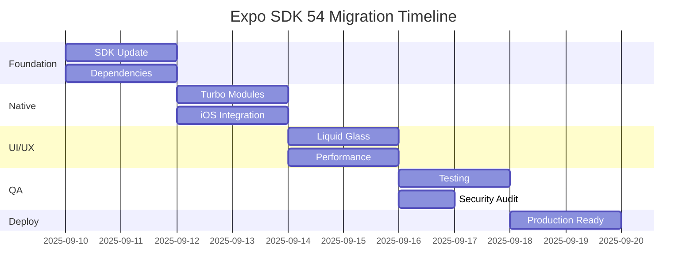

# Expo SDK 54 Migration Requirements Specification

**Project**: Weather Sunscreen App  
**Target**: Expo SDK 54.0.0 (Final Release)  
**React Native**: 0.81.1  
**Architecture**: New Architecture (Mandatory)  
**Review Authority**: John Carmack  
**Date**: September 10, 2025

## Executive Summary

This document outlines the complete requirements for migrating the Weather Sunscreen App to Expo SDK 54 with React Native 0.81's New Architecture. The project is partially migrated (currently on preview.16) but has **critical issues** that must be addressed immediately before proceeding with final implementation.

## 🚨 IMMEDIATE ACTION REQUIRED

**expo-doctor** has identified critical issues that will cause app crashes:
```bash
npx expo install expo-constants expo-linking  # Missing peer dependencies
npx expo install react-native@0.81.4          # Update React Native
npx expo install --check                      # Fix version mismatches
```

**Dependency cleanup required**:
- Remove `@types/react-native` from package.json (types included with react-native)
- Resolve build strategy conflict (precompiled vs source builds)
- Address CNG configuration warnings

## Current Project State Analysis

### ✅ Already Implemented
- Expo SDK 54.0.0-preview.16
- React Native 0.81.1 
- React 19.1.0
- New Architecture enabled (`newArchEnabled: true`)
- Reanimated v4 with worklets
- iOS 26.0 deployment target
- Precompiled React Native configuration
- iOS 26 compatibility patches in Podfile

### ⚠️ Requires Completion
- Upgrade to SDK 54.0.0 final release
- Complete New Architecture migration
- Dependency alignment and cleanup
- Performance optimization
- Security hardening
- Testing infrastructure

## Technical Requirements

### 1. Core Platform Dependencies

#### 1.1 Expo SDK Requirements
```json
{
  "expo": "54.0.0",
  "expo-router": "~6.0.0",
  "expo-dev-client": "~5.3.0",
  "@expo/metro-runtime": "~6.1.1"
}
```

#### 1.2 React Native Requirements
```json
{
  "react-native": "0.81.3",
  "react": "19.1.0",
  "react-dom": "19.1.0"
}
```

#### 1.3 New Architecture Dependencies
```json
{
  "react-native-reanimated": "~4.1.0",
  "react-native-worklets": "^0.5.0",
  "react-native-gesture-handler": "^2.20.0",
  "react-native-screens": "~4.16.0"
}
```

### 2. iOS Platform Requirements

#### 2.1 Xcode & Toolchain
- **Minimum**: Xcode 16.1
- **Recommended**: Xcode 26 (for iOS 26 features)
- **Deployment Target**: iOS 16.0 (production), iOS 26.0 (development)
- **Baseline Simulator Runtime**: iOS 26.0 (17A321)
- **Swift Version**: 6.0 with strict concurrency

#### 2.2 Precompiled Frameworks
```ruby
# Podfile configuration
ENV['RCT_USE_PREBUILT_RNCORE'] = '1'
ENV['RCT_USE_RN_DEP'] = '1'
ENV['HERMES_USE_PREBUILT_BINARY'] = '0'  # Xcode 26 simulator compatibility
```

#### 2.3 iOS 26 Liquid Glass Support
- Icon Composer integration (`.icon` format)
- `expo-glass-effect` implementation
- SwiftUI Expo UI beta integration
- Native glass effects in Weather displays

#### 2.4 WeatherKit Integration
```json
{
  "expo": {
    "plugins": [
      [
        "expo-build-properties",
        {
          "ios": {
            "entitlements": {
              "com.apple.developer.weatherkit": true
            }
          }
        }
      ]
    ]
  }
}
```

### 3. Android Platform Requirements

#### 3.1 Target Configuration
- **Target SDK**: Android 16 (API 36)
- **Minimum SDK**: Android 10 (API 29)
- **Compile SDK**: 36

#### 3.2 Edge-to-Edge Enforcement
```json
{
  "expo": {
    "plugins": [
      ["react-native-edge-to-edge", {
        "enforceNavigationBarContrast": true
      }]
    ]
  }
}
```

#### 3.3 Predictive Back Gesture
```json
{
  "android": {
    "predictiveBackGestureEnabled": false
  }
}
```

### 4. New Architecture Migration Requirements

#### 4.1 Fabric Renderer
- All custom components must implement Fabric specs
- Legacy Paper renderer components must be migrated
- Proper view hierarchies for edge-to-edge

#### 4.2 Turbo Modules
```typescript
// Native module interface compliance
interface WeatherNativeModule extends TurboModule {
  getCurrentLocation(): Promise<LocationData>;
  getWeatherData(lat: number, lon: number): Promise<WeatherData>;
  isAvailable(): Promise<boolean>;
}
```

#### 4.3 Codegen Integration
```json
{
  "codegenConfig": {
    "name": "WeatherAppSpecs",
    "type": "modules",
    "jsSrcsDir": "./src/specs"
  }
}
```

### 5. Performance Requirements

#### 5.1 Build Performance
- iOS clean builds: <30 seconds (vs. current 120s)
- Android builds: <45 seconds
- Hot reload: <2 seconds

#### 5.2 Runtime Performance
- App launch: <2 seconds cold start
- Navigation transitions: 60fps
- Weather data refresh: <500ms
- Memory usage: <150MB baseline

#### 5.3 Bundle Size Optimization
```javascript
// Metro config for tree shaking
module.exports = {
  experimentalImportSupport: true,
  transformer: {
    experimentalImportSupport: true,
  },
};
```

### 6. Security Requirements

#### 6.1 iOS Security Hardening
- WeatherKit entitlement properly configured
- Location permissions minimally scoped
- Certificate pinning for API calls
- Keychain secure storage implementation

#### 6.2 Android Security
- Network security config
- ProGuard/R8 optimization enabled
- Secure storage implementation
- Runtime Application Self-Protection (RASP)

### 7. Developer Experience Requirements

#### 7.1 Development Tools
```json
{
  "scripts": {
    "start": "expo start --dev-client",
    "prebuild": "expo prebuild --clean",
    "ios": "expo run:ios --device",
    "android": "expo run:android",
    "typecheck": "tsc --noEmit",
    "lint": "eslint . --fix",
    "test": "jest",
    "test:e2e": "maestro test"
  }
}
```

#### 7.2 React Compiler Integration
```json
{
  "babel": {
    "presets": [
      ["babel-preset-expo", {
        "react-compiler": true
      }]
    ]
  }
}
```

#### 7.3 Error Boundaries & Debugging
- Comprehensive error reporting
- React Developer Tools compatibility  
- Flipper integration for debugging
- Hermes debugger support

### 8. Testing Requirements

#### 8.1 Unit Testing
- Jest 29.7+ configuration
- React Native Testing Library
- 80%+ code coverage target
- Snapshot testing for UI components

#### 8.2 Integration Testing
- Expo Development Build testing
- Native module testing
- API integration testing
- Offline functionality testing

#### 8.3 E2E Testing
```yaml
# Maestro test configuration
appId: com.anonymous.weather-sunscreen-app
---
- launchApp
- assertVisible: "Weather Sunscreen"
- tapOn: "Get Weather"
- assertVisible: "Location Permission"
```

### 9. Migration Strategy

#### 9.1 Phase 1: Foundation (Days 1-2)
- Update to SDK 54.0.0 final
- Verify New Architecture configuration
- Update all dependencies
- Run comprehensive tests

#### 9.2 Phase 2: Native Modules (Days 3-4)
- Weather Native Module Turbo Module migration
- Liquid Glass Native Module implementation
- iOS WeatherKit integration
- Android Weather API fallback

#### 9.3 Phase 3: UI/UX Enhancements (Days 5-6)
- Liquid Glass effects implementation
- Edge-to-edge Android layout
- iOS 26 native tabs (Expo Router v6)
- Performance optimizations

#### 9.4 Phase 4: Quality Assurance (Days 7-8)
- Comprehensive testing suite
- Performance benchmarking
- Security audit
- Documentation updates

#### 9.5 Phase 5: Production Deployment (Days 9-10)
- EAS Build configuration
- Store deployment preparation
- Monitoring and analytics setup
- Rollback procedures

## Success Criteria

### Technical Metrics
- [ ] All dependencies updated to SDK 54 compatible versions
- [ ] New Architecture enabled and functional
- [ ] Zero legacy architecture dependencies
- [ ] All tests passing (unit, integration, E2E)
- [ ] Build times improved by >60%
- [ ] App performance metrics within targets
- [ ] Security audit passed with no critical issues

### Functional Requirements
- [ ] Weather data fetching operational
- [ ] Location services working
- [ ] Sunscreen recommendations accurate
- [ ] Liquid Glass effects functioning
- [ ] Cross-platform compatibility verified
- [ ] Offline functionality maintained

### Quality Assurance
- [ ] Code review by John Carmack completed
- [ ] Performance benchmarks met
- [ ] Security vulnerabilities addressed
- [ ] Documentation updated
- [ ] Deployment procedures verified

## Risk Assessment

### High Risk
- **Reanimated v4 Breaking Changes**: May require animation rewrites
- **iOS 26 Compatibility**: Simulator issues with Xcode 26
- **Native Module Migration**: Complex TurboModule implementation

### Medium Risk  
- **Android Edge-to-Edge**: UI layout adjustments needed
- **Dependency Conflicts**: Version incompatibilities
- **Performance Regressions**: New Architecture overhead

### Low Risk
- **Configuration Changes**: Well-documented migration paths
- **Testing Updates**: Incremental test fixes
- **Documentation**: Time-consuming but straightforward

## Implementation Timeline



## Appendices

### A. Dependency Matrix
Complete mapping of all dependencies and their SDK 54 compatible versions.

### B. Breaking Changes Log
Detailed list of breaking changes from current state to SDK 54.

### C. Performance Benchmarks
Baseline and target performance metrics.

### D. Security Checklist
Comprehensive security validation checklist.

---

**Document Version**: 1.0  
**Last Updated**: September 10, 2025  
**Next Review**: Post-implementation  
**Approval Required**: John Carmack
